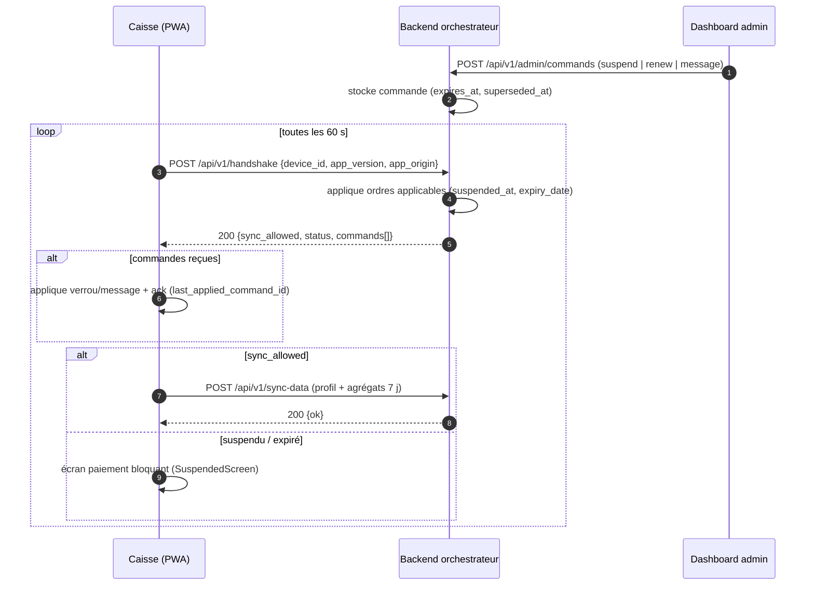

# Orchestrateur v2 — boîte aux lettres

## Principe

Le serveur **ne pousse jamais**. Chaque caisse sonne (handshake), applique les ordres en
attente, puis ne synchronise des données **que si** elle y est autorisée (`sync_allowed`).
Cela fonctionne offline-first : une caisse hors ligne conserve son verrouillage de
suspension (appliqué localement lors du dernier contact) et ne vend plus.

## Flux

## Règle d'or

- Le handshake applique **immédiatement** suspend/renew côté serveur : une caisse hors
  ligne reste donc verrouillée même sans commande locale.
- Ack **implicite** au handshake suivant (`last_applied_command_id` → `delivered_at`).
- Idempotence par `superseded_at` : un double clic sur Prolonger ne produit qu'une seule
  commande effective.
- Les suppressions restent logiques ; les lectures filtrent `alive()`.

## Synchronisation

La sync envoie le **profil** (identité boutique, abonnement) + des **agrégats légers**
(7 jours, via `computePeriodStats`) — jamais les lignes de vente brutes.

## Champ `app_origin`

Ajouté dès maintenant au handshake et à `sync_payloads` (défaut `'pos'`) : il permettra
plus tard au dashboard de distinguer plusieurs apps par device, sans migration casse-tête.

## Projets — un dashboard dédié par projet

Chaque projet a **son propre mot de passe** et ne voit **que ses caisses** (scope du
token). Le rattachement se fait par `shops.app_origin` :

- **Connexion** : `POST /api/login` — sans `project` → administrateur (scope `master`,
  voit et gère tout) ; avec `project` + le mot de passe du projet → scope `project`,
  limité à ses caisses.
- **Projet de référence** : `'pos'` est semé au démarrage avec le mot de passe admin
  (rétrocompat : l'ancien login unique retrouve son dashboard).
- **Auto-création** : un handshake avec un `app_origin` inconnu crée le projet
  (mot de passe aléatoire, loggé) — l'admin le sécurise ensuite dans son dashboard.
- **Routes projets** (master uniquement) : `GET/POST /api/v1/admin/projects`,
  `POST /api/v1/admin/projects/:id/password`.
- **Garde-fous** : une session projet ne peut ni lister, ni commander une caisse hors
  de son projet (`403`).

## Champs clés

| Champ | Store / table | Rôle |
| --- | --- | --- |
| `suspended_at` | `shops` | verrouillage effectif (côté serveur ET local) |
| `last_applied_command_id` | settings IndexedDB | idempotence + ack |
| `superseded_at` | `admin_commands` | idempotence (1 commande effective) |
| `expires_at` | `admin_commands` | alerte « commande expirée » au dashboard |
| `delivered_at` | `admin_commands` | badge « récupérée / en attente » au dashboard |
| `last_sync_at` | `shops` | dernière synchronisation de la caisse |
